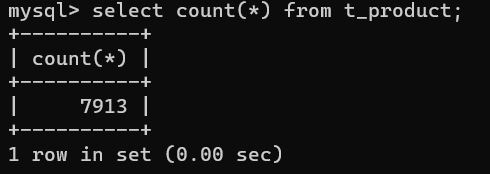
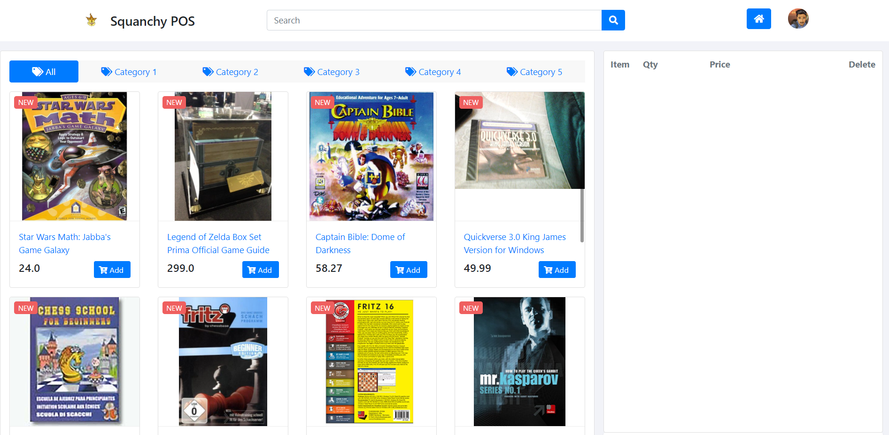

# aw06

### 1、解析metadata并持久化到数据库

##### 1.1 下载metadata

我所下载的种类分别是`Appliance`和`Video Games`，创建一个工程名为batch-data，用来对这两个json文件进行处理。仿照示例代码，将文件存放在classpath下的data目录之下，用于对文件进行读取

##### 1.2 配置Partition

由于示例代码已经完成了大量的配置，所以在这里只需要修改一些参数，具体将`TaskExecutor`核心线程数设置为4，最大线程数设置为8，队列大小设置为20。

##### 1.3 配置Processor，将一行数据转换成Product

为了能够将json文件中的数据中的有效信息提取出来，在process方法中做出来一定的逻辑判断，简单来说就是将JsonNode中的数据对应数据取出来，并判断其是否合法。在此过程中会遇到一些小问题，为了能够持久化到数据库中，并且和aw04中所使用的数据保持一致，所以我建立的`Product`类拥有四个字段，这些字段在一行json数据中往往是不能直接使用的，例如price字段需要去除额外的`$`字符，image字段需要判断是否为空数组，title字段的值是否是有效的描述而非一个奇怪的标签。

##### 1.4 配置Writer，将Product写入到MySQL数据库

Product的写入需要借助JdbcTemplate来操作数据库。具体需要配置数据库连接池的四个参数，然后我新建了一个mapper来执行持久化数据库的操作，相对比较简单。

##### 1.5 运行项目完成读取、转换、持久化操作

本来基本的项目配置到此为止，但是在运行项目的过程中会报很多错，经过查阅可知，batch在操作数据库的时候，需要建立一系列特定的表，但是这些表在自动创建的时候失败了，需要人为导入到数据库，具体执行的sql语句文件init.sql放在了batch-data项目的根目录下。

最终启动项目，完成持久化操作，最终使用命令查看数据库中被持久化的数据条数为7913，如图所示。

### 2、将数据库集成到aw04中

##### 1、创建AmazonDB类

引入相关依赖，配置数据库的相关参数，创建PosDB的另一个实现类，命名为AmazonDB，其关于Product的读取均是从MySQL数据库中完成，当然这里的数据库中的表存放着前面所持久化后的数据。

##### 2、分页查询

在以前的版本中，首页会直接请求所有的数据，然后将数据展示在浏览器首页，在数据量比较小的时候尚可，但是现在的数据有7913条，全部展示是不现实的，所以在service层的list方法处默认截取20条数据进行首页展示，最终的首页如图：

由于采用的这种分层的架构以及Spring的IoC，导致对于某一层进行了修改之后，其他代码完全都没有收到影响，算是第一次非常真实的体验到这种架构以及IoC所带来的实际好处。

---

[Amazon Review Data (2018)](https://nijianmo.github.io/amazon/index.html) has a huge products metadata set of multiple categories.

|category| reviews | metadata |
|--| -- | -- |
|Amazon Fashion|reviews (883,636 reviews)|metadata (186,637 products)|
|All Beauty|reviews (371,345 reviews)|metadata (32,992 products)|
|Appliances|reviews (602,777 reviews)|metadata (30,459 products)|
| ... |
|Tools and Home Improvement|reviews (9,015,203 reviews)|metadata (571,982 products)|
Toys and Games|reviews (8,201,231 reviews)|metadata (634,414 products)|
Video Games|reviews (2,565,349 reviews)|metadata (84,893 products)|

Please finish the following tasks:

- Download no less than two categories of these metadata.
- Referring the example code in this repo, convert each line in the downloaded files into a POJO of `Product` class and save the object in a database like MySQL. 
- Integrate the database containing Amazon products with your own AW04 project and build an Amazon WebPOS system.

And, of course, always try to make the system run as fast as possible.
